# CI/CD Deployment — DevOps Assignment

## 👨‍💻 Candidate: Aksar Shaik
**Role:** DevOps Engineer Intern Assignment — Discover Dollar

---

## 🏗️ Architecture Overview

The following diagram illustrates the automated CI/CD flow from the developer's local machine to the AWS EC2 production environment.

```text
               

Developer
│
│ Git Push
▼
GitHub Repository
│
│ Webhook Trigger
▼
Jenkins (CI/CD on AWS EC2)
│
├── Build Docker Image
├── Push to Docker Hub
└── Deploy with Docker Compose
│
▼
┌──────────────────────┐
│ AWS EC2 VM │
│ │
│ Application │
│ (Docker Containers)│
│ │
│ Exposed via │
│ Nginx :80 │
└──────────────────────┘
│
▼
End Users

```
## 🛠️ Tech Stack

- **Frontend:** Angular  
- **Backend:** Node.js + Express  
- **Database:** MongoDB  
- **Containerization:** Docker  
- **Orchestration:** Docker Compose  
- **CI/CD:** Jenkins + GitHub Webhooks  
- **Reverse Proxy:** Nginx  
- **Cloud:** AWS EC2 (Ubuntu)

## 🚀 Step-by-Step Implementation

### 1️⃣ Repository Setup

The project is structured to separate concerns between frontend, backend, and infrastructure configuration.

#### 📁 Directory Structure

```bash
task-app-ci-cd/
 ├── frontend/           # Angular Application
 ├── backend/            # Node.js API
 ├── nginx/              # Nginx Configuration
 ├── docker-compose.yml  # Multi-container orchestration
 ├── Jenkinsfile         # CI/CD Pipeline script
 └── README.md
```
## 2️⃣ Dockerization

### 📍 Backend Dockerfile (`backend/Dockerfile`)
The backend service is containerized using Node.js to run the Express API.

### 📍 Frontend Dockerfile (`frontend/Dockerfile`)
The frontend uses a **multi-stage build** to keep the production image lightweight and optimized for deployment.

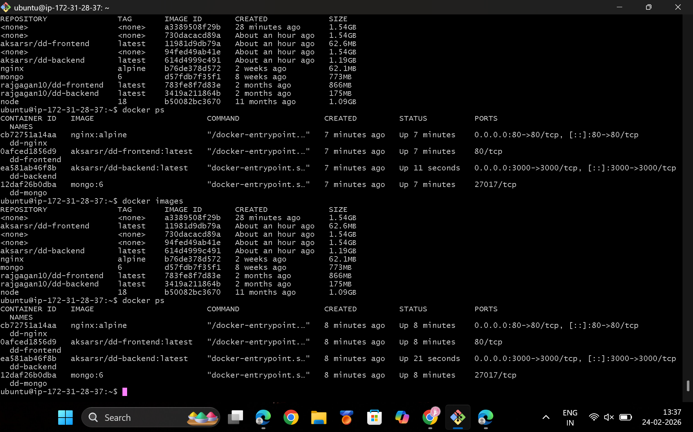

---

## 3️⃣ Docker Hub Integration

Docker images are tagged and pushed to Docker Hub for centralized storage and version management.

```bash
docker login
docker build -t aksarsr/dd-backend ./backend
docker build -t aksarsr/dd-frontend ./frontend
docker push aksarsr/dd-backend
docker push aksarsr/dd-frontend
```
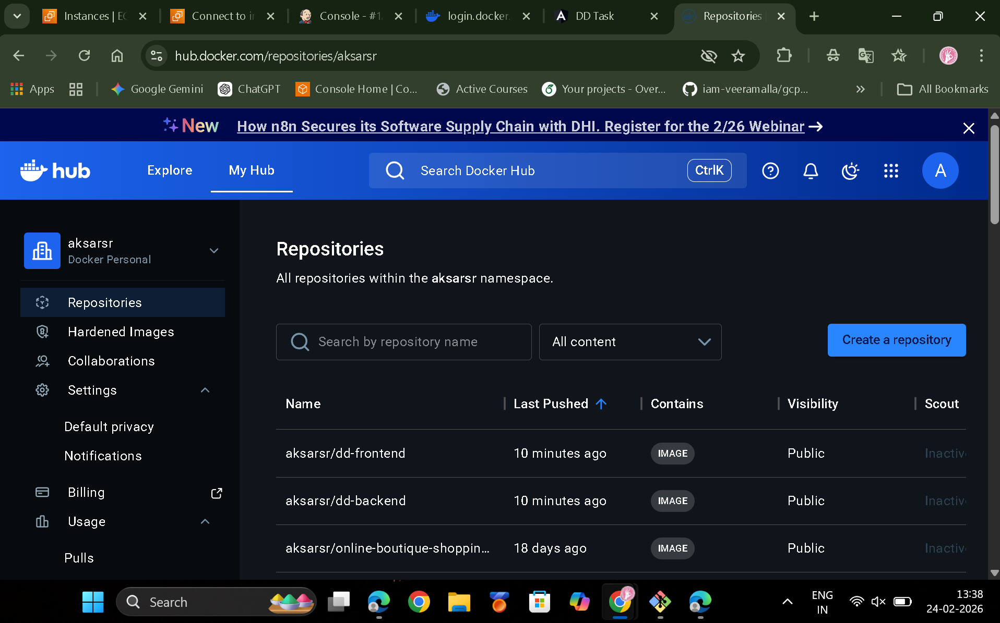
## 4️⃣ Docker Compose Deployment

The `docker-compose.yml` file manages the lifecycle of all services, including:

- MongoDB database
- Backend API
- Frontend application
- Nginx reverse proxy

Docker Compose ensures that all containers run together within a single network, enabling seamless communication between services.

---

## 5️⃣ Nginx Reverse Proxy

Nginx is configured to route traffic to the appropriate container based on the URL path:

- `/` → Frontend (Angular application)
- `/api` → Backend (Node.js API)

This setup allows the entire application to be accessed through **port 80** using a single entry point.

## 6️⃣ CI/CD Pipeline (Jenkins)

The Jenkins pipeline automates the complete build and deployment workflow whenever code is pushed to GitHub.

### 🔄 Pipeline Stages

#### 🔹 Build
Create Docker images from the latest source code.

#### 🔹 Push
Upload Docker images to Docker Hub for centralized storage.

#### 🔹 Deploy
Pull the latest images on the EC2 instance and restart containers using Docker Compose.

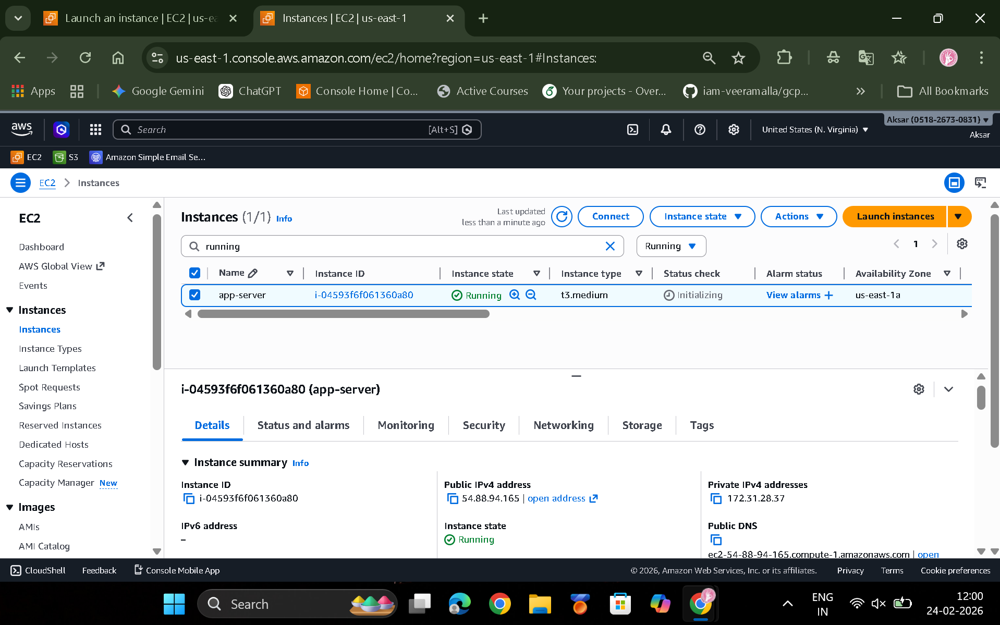

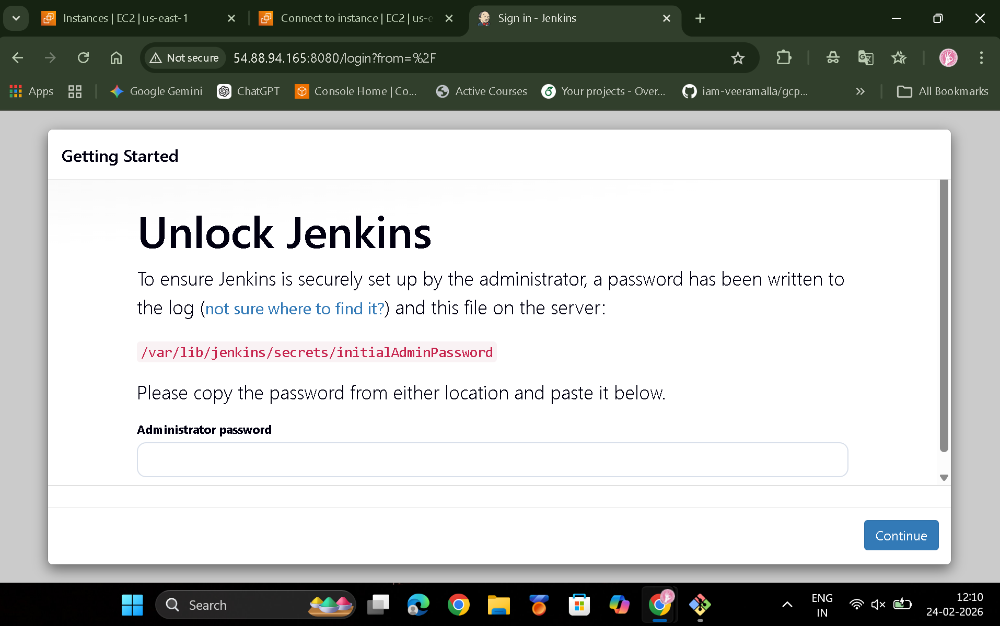

---

## 🔐 Docker Hub Credentials Setup in Jenkins

To securely push images to Docker Hub:

1. Go to **Jenkins Dashboard → Manage Jenkins → Manage Credentials**
2. Select **Global credentials**
3. Click **Add Credentials**
4. Choose **Username with password**
5. Enter:
   - **Username:** Docker Hub username
   - **Password:** Docker Hub password or access token
   - **ID:** `dockerhub-creds`
6. Save

The Jenkins pipeline uses these credentials to authenticate during image push.

---

## 🔌 Required Jenkins Plugins

Install the following plugins for CI/CD functionality:

- **Docker Pipeline Plugin** — enables Docker commands in pipelines
- **Git Plugin** — allows Jenkins to pull code from GitHub
- **GitHub Integration Plugin** — enables webhook triggers
- **Pipeline Plugin** — required for Jenkinsfile pipelines
- **Pipeline Stage View Plugin** — visualizes pipeline stages

### 📊 Stage View

After installing the **Pipeline Stage View Plugin**, Jenkins displays a visual pipeline flow showing:

- Checkout
- Build
- Push
- Deploy

This helps monitor pipeline progress and debug failures quickly.

---

## 🔗 GitHub Webhook Configuration

To enable automatic pipeline triggers on code changes, GitHub Webhooks were configured.

---

### 🔹 Before: Using Poll SCM Trigger

Initially, Jenkins was configured with **Poll SCM**:

This made Jenkins check the repository every minute for changes.

#### ❌ Limitations of Poll SCM
- Inefficient — Jenkins continuously polls GitHub even when there are no changes.
- Delayed builds — pipeline runs based on schedule, not instantly.
- Higher resource usage on Jenkins.

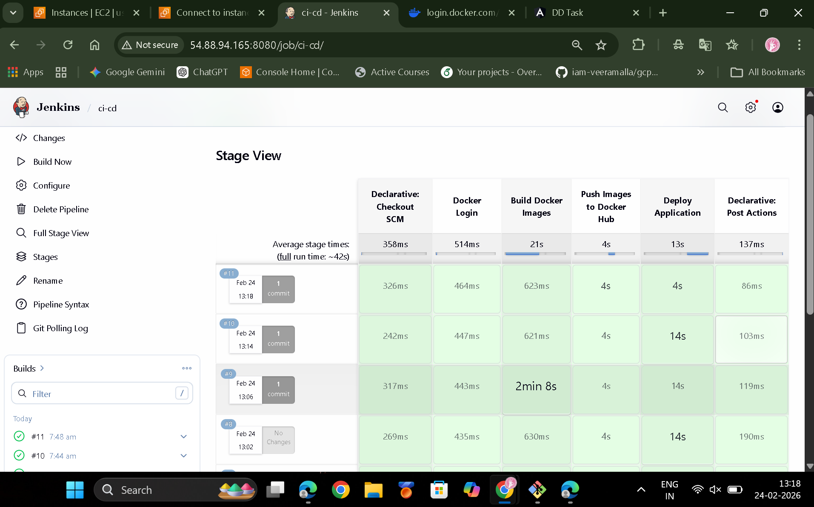
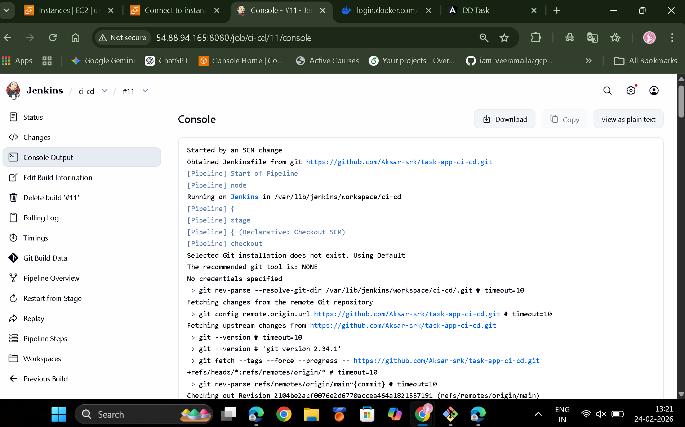


---

### 🔹 After: Using GitHub Webhook (Recommended)

To meet the assignment requirement and improve efficiency, GitHub Webhooks were configured.

#### Webhook Settings

- **Payload URL:** `http://<EC2-IP>:8080/github-webhook/`
- **Content Type:** `application/json`
- **Trigger:** Push events

Now, whenever code is pushed to GitHub, Jenkins is triggered instantly.
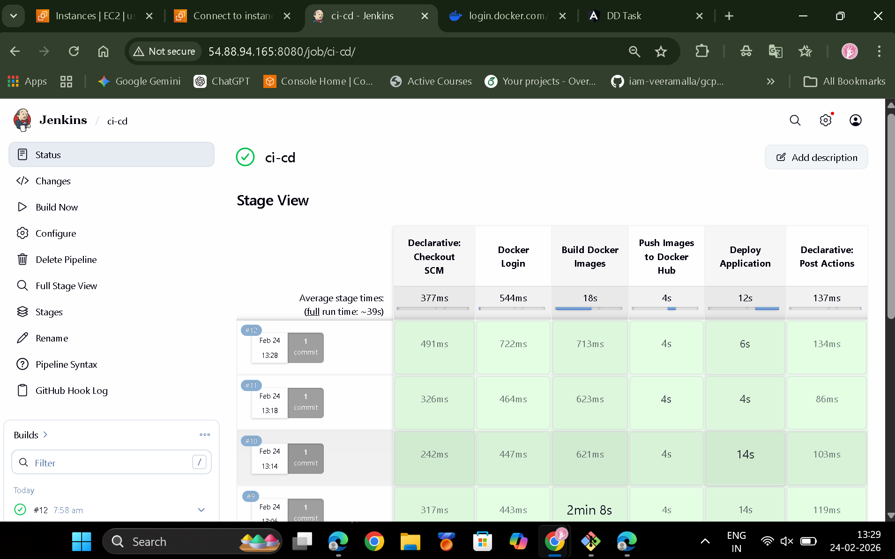
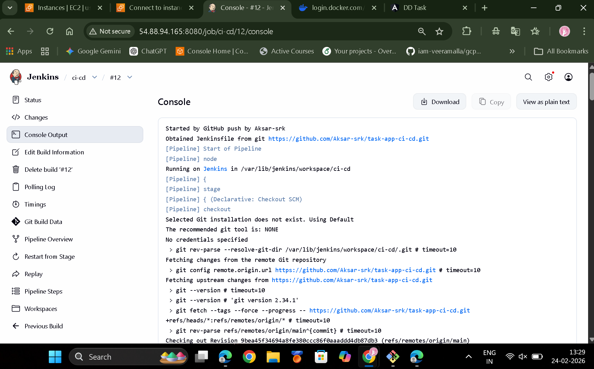

#### ✅ Advantages of Webhooks over Poll SCM

- Real-time pipeline execution.
- No unnecessary polling → efficient resource usage.
- Faster feedback for developers.
- Industry-standard CI/CD practice.

📸 _Add screenshots:_
- GitHub webhook settings
- Successful webhook delivery
- Jenkins pipeline triggered by GitHub push

---

### 🔄 Before vs After Summary

| Feature | Poll SCM | Webhook |
|--------|---------|---------|
| Trigger type | Scheduled polling | Event-based |
| Speed | Delayed | Instant |
| Resource usage | High | Low |
| Industry best practice | ❌ | ✅ |

## 🖥️ Final Application UI

The MEAN stack application is successfully deployed and accessible 

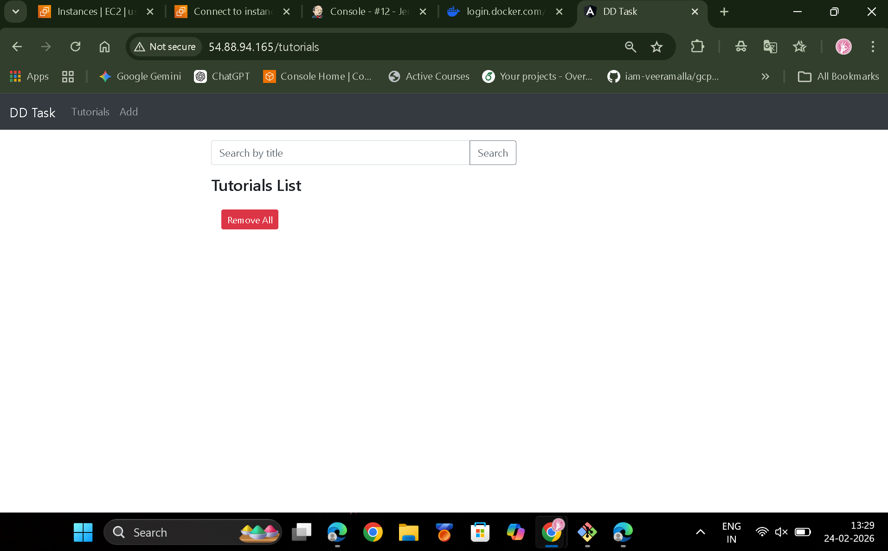

🌐 **Live URL:**  
👉 http://ec-2-public-ip


## 🐞 Issues Faced & Fixes

This section highlights real-world issues encountered during deployment and how they were resolved.

---

### ❌ Issue 1: Docker Permission Denied

**Error**
permission denied while trying to connect to Docker daemon

**Cause**  
The Jenkins user did not have permission to access the Docker daemon.

**Fix**
```bash
sudo usermod -aG docker jenkins
sudo systemctl restart jenkins
```
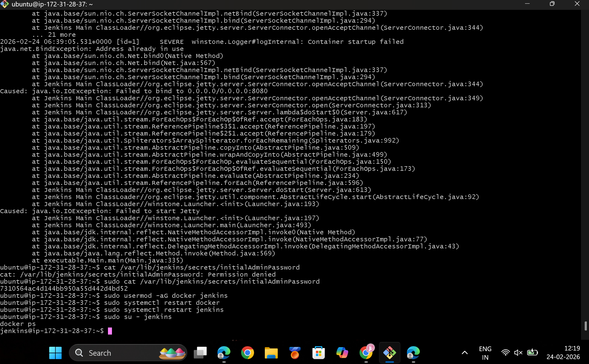

### ❌ Issue 2: Dockerfile Empty Error

**Error**
Dockerfile cannot be empty

**Cause**  
The Dockerfile existed but contained no instructions.

**Fix**
- Added proper Dockerfile instructions.
- Committed the changes.
- Pushed the updated code to GitHub to trigger the CI/CD pipeline.

- **Payload URL:** `http://<EC2-IP>:8080/github-webhook/`
- **Content Type:** `application/json`
- **Trigger:** Push events

Once configured, every GitHub push triggers the Jenkins pipeline automatically.
### ❌ Issue 3: Nginx Mount Error

**Error**
not a directory: mounting nginx.conf

**Cause**  
`nginx.conf` was mistakenly created as a directory instead of a file.

**Fix**
```bash
rm -rf nginx/nginx.conf
touch nginx/nginx.conf
```
### ❌ Issue 4: 502 Bad Gateway

**Cause**  
Nginx was routing traffic to incorrect container images.

**Fix**
Updated `docker-compose.yml` to use the correct Docker Hub images:

```yaml
image: aksarsr/dd-frontend
image: aksarsr/dd-backend
```
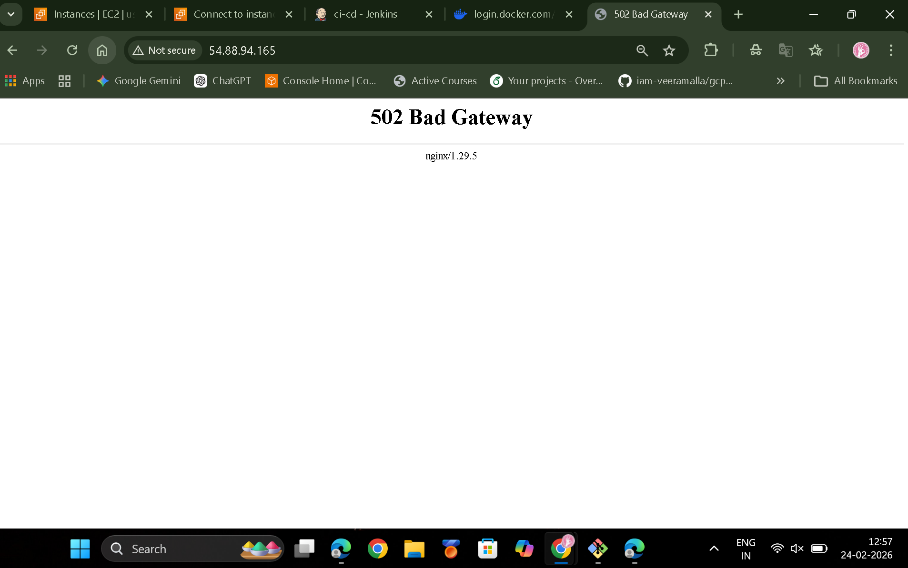
